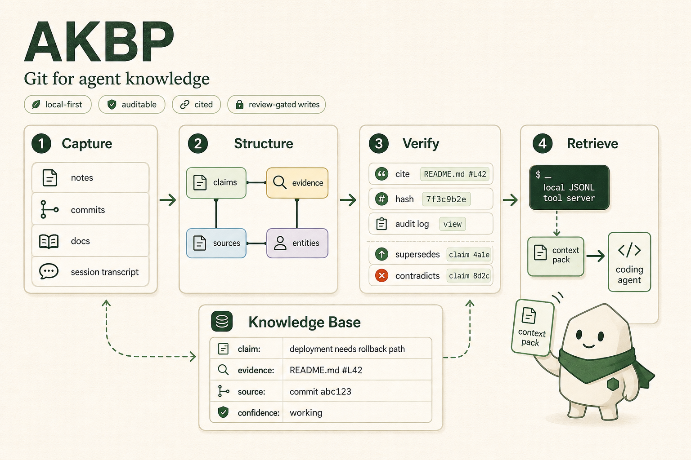

# AKBP

[](https://github.com/rohitg00/akbp/actions/workflows/ci.yml)

<p align="center">
  
</p>

> Agents should not start every session with amnesia.

AKBP turns the LLM Wiki pattern into a protocol surface for agent runtimes. It is a local-first, file-backed knowledge base that agents can read, write, verify, export, and carry across tools.

The idea comes from the same insight behind [LLM Wiki v2](https://gist.github.com/rohitg00/2067ab416f7bbe447c1977edaaa681e2): stop re-deriving, start compiling. AKBP adds the machinery a repo needs when that pattern becomes operational: typed claims, source hashes, lifecycle relations, review-gated writes, JSONL tool calls, schemas, and conformance tests.

This repository contains the reference implementation:

- a Python CLI for creating and maintaining AKBP knowledge bases
- a newline-delimited JSON tool server for agent integrations
- JSON schemas for requests, responses, records, and method parameters
- adapter templates for coding-agent runtimes
- conformance checks, benchmark fixtures, import/export checks, and CI validation

It is still alpha. The implementation is usable for demos, adapter work, protocol review, and early dogfooding, but it is not a 1.0 compatibility promise.

## Why this exists

Most agent memory is either trapped in a chat transcript, hidden inside one product, or rebuilt from scratch with every session. Repository instruction files help with behavior, but they do not capture reviewed project knowledge. Plain RAG can retrieve documents, but it does not define how durable claims, evidence, source hashes, audit history, and lifecycle updates should be represented.

The LLM Wiki pattern solves the right problem: useful knowledge should compound. AKBP takes that pattern one step lower in the stack and defines the artifacts, methods, schemas, and safety gates agents need to maintain it consistently.

```text
agent runtime reads project context
  -> evidence is registered as sources
  -> durable claims are proposed from notes or transcripts
  -> writes are previewed and reviewed
  -> approved claims, pages, sources, and relations are stored as files
  -> local indexes are rebuilt from source-of-truth artifacts
  -> the next agent session receives cited context instead of guesswork
```

The goal is not to replace model context, repository instructions, tool protocols, vector databases, or second-brain tools. AKBP gives those systems a portable knowledge substrate they can share.

## Honest limits

AKBP is not a research breakthrough claim and it is not a finished memory product. The useful part today is the protocol discipline: files, schemas, source-backed claims, lifecycle states, review-gated writes, search indexes, export bundles, and conformance checks.

The reference implementation still needs larger retrieval-quality benchmarks, broader adapter dogfooding, clearer migration policy, and more long-document ingest proof before it should be treated as mature.

Critique tracking lives in `docs/CRITIQUE_RESPONSE.md` so public feedback turns into fixtures, docs, and implementation work instead of vague positioning.

## What ships today

| Area | Current support |
|------|-----------------|
| Knowledge base | `AKBP.md`, `akbp.json`, markdown wiki pages, JSONL claims, graph records, sources, and audit log |
| CLI | `init`, `source add`, `ingest`, `remember`, `crystallize`, `index`, `search`, `context`, `doctor`, `export`, `export-check`, `import-check`, `import-apply`, `conformance` |
| JSONL tool server | `akbp.capabilities`, knowledge-capability descriptor, `akbp.status`, retrieval methods, write methods, lifecycle methods, structured responses, and structured errors |
| Schemas | Request envelope, response envelope, method params, claims, sources, entities, relations, pages, evidence, audit events, and context packs |
| Write safety | `dry_run:true`, `approved:true`, `approval_required`, review-gated writes, redaction, request limits, path validation, and schema-backed param checks |
| Retrieval | SQLite FTS5 search, context packs, citations, source verification, and retrieval benchmark fixtures |
| Portability | Export manifests with artifact paths, SHA-256 hashes, object counts, safety flags, and verification metadata |
| Adapters | Public-safe adapter templates and examples for local coding-agent runtimes |
| Validation | `make validate`, unit tests, benchmark runner, smoke tests, install smoke tests, and GitHub CI across Python 3.9 to 3.12 |

## See it work

If this is your first run, start with `docs/GETTING_STARTED.md`. It gives a ten-minute path from empty checkout to reviewed memory, cited recall, and export checking.

Run the public-alpha demo:

```bash
git clone https://github.com/rohitg00/akbp.git
cd akbp
make demo
```

The demo creates a temporary knowledge base, discovers JSONL tool-server capabilities, previews a reviewed decision, rejects the same write without approval, applies it after approval, verifies evidence, builds search, retrieves context, exports a portable bundle, checks that bundle, and runs level 3 conformance.

Expected success markers:

```text
AKBP quickstart demo
Initialized AKBP knowledge base at ...
{"id": "caps", "ok": true}
{"dry_run": true, "id": "ingest-preview"
{"error": {"code": "approval_required"}, "id": "ingest-blocked", "ok": false}
{"id": "ingest-approved", "ok": true
{"id": "index-approved", "indexed":
"verified": 1
"results": [
"items": [
"ok": true
AKBP quickstart demo passed
```

Direct CLI path:

```bash
python3 cli/akbp.py --path ./my-kb init --level 0
python3 cli/akbp.py --path ./my-kb source add notes.md --type file --title "Project notes"
python3 cli/akbp.py --path ./my-kb ingest notes.md --claim "Capture the durable decision from this note." --claim-type decision
python3 cli/akbp.py --path ./my-kb source verify --fail-on-issue
python3 cli/akbp.py --path ./my-kb index --incremental
python3 cli/akbp.py --path ./my-kb doctor
python3 cli/akbp.py --path ./my-kb search "durable decision"
python3 cli/akbp.py --path ./my-kb context "continue this project"
```

## Install

Repo-local development:

```bash
python3 cli/akbp.py --help
```

Installed console scripts:

```bash
python3 -m pip install .
akbp --path ./my-kb init --level 0
akbp-tool-server < requests.jsonl
```

Full install and verification notes are in `docs/INSTALL.md`.

## The sprint loop for agents

AKBP is designed for short, repeated agent sessions where the next runtime must understand what the previous runtime proved, changed, or decided.

| Moment | AKBP operation |
|--------|----------------|
| Session starts | Call `akbp.capabilities`, then `akbp.session.start`, `akbp.context`, or `akbp.search` |
| Agent reads files or notes | Register evidence with `akbp.source.add` |
| Agent finds a durable fact or decision | Preview with `akbp.remember`, `akbp.ingest`, or `akbp.session.end` using `dry_run:true` |
| User or trusted policy approves | Apply with request-level `approved:true` |
| Session finishes | Crystallize reviewed transcript sections and refresh the search index |
| Another runtime starts later | Retrieve compact context with citations and source-backed claims |

The core rule: agents can propose memory, but durable writes are review-gated.
Keep runtime scratch, raw transcripts, temporary plans, and private tool caches
out of AKBP unless they are promoted through the reviewed session-memory
boundary in `docs/SESSION_MEMORY_BOUNDARY.md`.

See `docs/AGENT_FLOW.md`, `docs/AKBP_WORKFLOW.md`, `docs/ADOPTION_DECISION_GUIDE.md`, `docs/CROSS_RUNTIME_CONTEXT.md`, `docs/DEVELOPER_PROTOCOL_FIT.md`, `docs/TOOL_PROTOCOL_BRIDGE.md`, `docs/TEMPLATES.md`, `docs/USE_CASES.md`, `docs/RICH_CONTEXT_ARTIFACTS.md`, `docs/USABILITY_DEMO_PLAN.md`, `docs/PROTOCOL_LANDSCAPE_LEARNINGS.md`, `docs/BENCHMARK.md`, `examples/session-start-harness/`, `examples/tool-protocol-bridge/`, and `examples/tool-server-approval-flow/`.

For first-run adoption gates, `examples/adoption-preflight/` verifies that a
fresh knowledge base starts with a read-only trust boundary, becomes cited
startup context ready only after evidence and indexing, proves nested
`akbp discover` exposes profile selection and the ten-minute proof for adapter
installers, emits portable client config without local paths, and rejects
unapproved writes.
For inherited or older agent-written repositories, `examples/inherited-repo-intake/`
adds the takeover-specific gate: verify source freshness before trusting cited
startup context, and keep stale or changed handoffs as review blockers instead
of planning from outdated memory.
`examples/project-understanding-bridge/` answers the common
`project-understanding.md` objection with a runnable proof: keep plain
markdown as scratchpad evidence, promote only reviewed claims, block unapproved
writes, retrieve cited startup context, and export-check the portable bundle.
`examples/context-freshness-probe/` isolates that freshness gate into a small
adapter preflight: verified sources plus cited startup context pass, while
changed source evidence fails closed before recalled memory affects planning.

For adapter quality gates, `examples/structured-output-harness/` shows how to
machine-check response envelopes, capability negotiation, cited startup context,
dry-run review metadata, and the `approval_required` stop signal before a
runtime trusts AKBP memory or enables writes.
The `akbp.capabilities` response includes a `knowledge_capability` descriptor so
tool hosts can classify AKBP as a local, cited, review-gated agent knowledge
base before mapping it into tool-protocol or host-native memory surfaces.
`akbp discover` and `akbp client-config` also emit an
`adapter_prompt_contract` block so adapters can turn that harness into concrete
runtime instructions: retrieve bounded cited context before planning, continue
without recalled memory when context is empty or uncited, and keep durable
writes behind dry-run preview plus approved apply.
`akbp discover` also emits `response_contract`, a compact machine-readable
gate for installer UIs: preserve the JSONL response envelope, fail closed on
uncited or truncated startup context, stop on `approval_required`, and run the
structured-output harness before exposing write-capable tools.
`recommended_commands.adapter_harness` points directly to the runnable harness
so installers can make that response-contract check part of the first discovery
flow instead of hunting through docs.

To run the adapter harness as a single adoption gate:

```bash
make adapter-harness
```

Use this before enabling AKBP in a new coding-agent adapter. It runs the
runnable structured-output example and the focused adapter-quality benchmark
against the real CLI and JSONL tool server.

## Knowledge base layout

A minimal AKBP knowledge base starts with two files:

```text
AKBP.md      human-readable entry point for agents and maintainers
akbp.json    machine-readable Knowledge Base Card
```

A fuller knowledge base adds portable artifacts:

```text
wiki/                  compiled markdown knowledge
claims/claims.jsonl    atomic claims with evidence and lifecycle state
graph/entities.jsonl   entities referenced by claims and pages
graph/relations.jsonl  typed relations and lifecycle links
raw/sources/           optional copied source material
.akbp/audit.log.jsonl  append-only operation history
```

Local runtime state lives under `.akbp/`, including the rebuildable SQLite FTS5 index. Markdown and JSONL artifacts are the source of truth.

For new repositories, `templates/project-memory-rules/AKBP.md` is a copyable starter rule file. It defines durable knowledge, evidence, approval, secret-handling, lifecycle, validation, and adapter rules before any write-capable integration is enabled.

## Tool server contract

Agents integrate through newline-delimited JSON. Each request is one JSON object per line. Each response uses the same envelope:

```json
{"id":"request-id","ok":true,"result":{},"error":null}
```

Capability discovery:

```json
{"id":"caps-1","method":"akbp.capabilities"}
```

Context retrieval:

```json
{"id":"ctx-1","method":"akbp.context","path":".","params":{"task":"current release decisions","limit":5}}
```

Write preview:

```json
{"id":"write-preview-1","method":"akbp.remember","path":".","dry_run":true,"params":{"text":"Decision: keep public alpha releases small and evidence-backed."}}
```

Approved write:

```json
{"id":"write-apply-1","method":"akbp.remember","path":".","approved":true,"params":{"text":"Decision: keep public alpha releases small and evidence-backed."}}
```

Adapters should branch on `ok` and `error.code`, not on free-form error text. Method parameters are documented in `schemas/tool-methods.schema.json`; response shapes are documented in `schemas/tool-response.schema.json`.

See `docs/TOOL_CONTRACT.md` and `examples/tool-error-handling/`.

## Adapter path

Start here if you want AKBP inside a coding agent, IDE agent, task runner, local assistant, or research workflow:

If the same project moves between multiple coding agents, read `docs/CROSS_RUNTIME_CONTEXT.md` first. It defines the handoff contract: retrieve cited context at session start, keep scratch state inside the runtime, preview durable memory writes, apply only after approval, and let the next runtime restart from AKBP artifacts instead of copied chat transcripts.

If the host speaks a tool protocol, read `docs/TOOL_PROTOCOL_BRIDGE.md` before exposing AKBP tools. The recommended first bridge is read-only and forwards a small allowlist to the local JSONL server so hosts can retrieve cited context without turning the bridge into another opaque memory store.

Fastest read-only setup:

```bash
python3 cli/akbp.py --path ./my-kb init --level 0
python3 cli/akbp.py --path ./my-kb client-config --name my-adapter --profile read-only
```

That prints a pasteable stdio JSONL config with the server command, knowledge-base path, startup capability request, required workflow profile, session-start method, and safety rules. Use read-only first when the host runtime cannot show a write preview or collect explicit approval.

Reviewed-write setup:

```bash
python3 cli/akbp.py --path ./my-kb client-config --name my-adapter --profile reviewed-writes
```

Enable that only when the adapter can surface `dry_run:true` previews, warnings, would-write paths, and the approval step. The apply request should repeat the reviewed method/path/params with `approved:true`.

Adapter implementation checklist:

1. Read `docs/ADAPTER_AUTHOR_QUICKSTART.md`.
2. Copy `adapters/coding-agent-template/` when you need a full adapter package.
3. Call `akbp.capabilities` at startup.
4. Retrieve context before planning.
5. Preview writes with `dry_run:true`.
6. Apply only with `approved:true` or an explicit trusted local policy.
7. Store durable output in AKBP artifacts.
8. Run `make validate`.

`docs/ADAPTER_AUTHOR_QUICKSTART.md` includes a runtime matrix for terminal agents,
editor agents, local assistants, custom scripts, and hosted tool bridges so new
adapter authors can choose the safest first profile before writing glue code.

Tracked adapter directories:

```text
adapters/coding-agent-template/
adapters/example-coding-agent/
adapters/terminal-coding-agent/
adapters/editor-coding-agent/
adapters/openclaw/
adapters/codex/
adapters/github-copilot/
adapters/claude-code/
adapters/cursor/
adapters/gemini-cli/
```

## Architecture

```text
Agent runtime, IDE, task runner, or local assistant
        |
        | CLI command or JSONL request
        v
Reference interface layer
  - akbp console script
  - akbp-tool-server JSONL server
        |
        v
Protocol operations
  - initialize and validate
  - register and verify sources
  - ingest reviewed source material
  - remember cited claims
  - crystallize session transcripts
  - retrieve search results and context packs
  - export, check, import, and audit bundles
        |
        v
AKBP knowledge base
  - markdown and JSONL source-of-truth artifacts
  - append-only audit log
  - rebuildable local SQLite FTS5 index
```

Read the current architecture map in `docs/ARCHITECTURE.md`.

## Data model

AKBP separates durable knowledge from runtime indexes:

- sources record evidence locators, hashes, type, scope, and metadata
- claims store atomic project facts, decisions, workflows, warnings, and observations
- entities identify named systems, tools, projects, files, people, or concepts referenced by claims
- relations connect claims and entities, including lifecycle edges such as supersedes and contradicts
- pages provide human-readable compiled knowledge for agents and maintainers
- audit events record write operations and validation-relevant actions

The SQLite search index is rebuildable. The protocol artifacts are the portable state.

## Validation

The public gate is:

```bash
make validate
```

It runs:

```text
make guard
make test
make smoke
make examples
make benchmark-score
make benchmark
make install-smoke
```

GitHub CI runs full validation across Python 3.9, 3.10, 3.11, and 3.12, then builds package artifacts.

The repo includes:

- `tests/` for CLI, tool server, schemas, docs, adapters, and repo quality
- `benchmarks/fixtures/` for durable retrieval, citation, write-safety, import/apply, and capability scenarios
- `examples/quickstart-demo/` for the one-command happy path
- `examples/akbp-bench/` for a small scorecard covering cited writes, retrieval, supersession, export, and conformance
- `examples/repo-memory-demo/` for turning issue, PR, and release-note fixtures into later-session context
- `examples/memory-ci/` for CI gates around lint, source verification, conformance, export-check, import-check, and dry-run apply
- `examples/adoption-preflight/` for the first-run trust gate before an adapter or host treats AKBP as memory
- `examples/jsonl-quickstart/` for the canonical tool-server sequence: capabilities, session start, dry-run write, approval gate, approved apply, index, context, and export
- `examples/adapter-lifecycle/` for `akbp.session.start` and `akbp.session.end` wiring
- `examples/structured-output-harness/` for adapter response-contract checks before trusting recalled context or enabling reviewed writes
- `examples/tool-protocol-bridge/` for read-only bridge preflight before exposing AKBP through a tool host
- `examples/existing-memory-migration/` for promoting source-backed records from an existing memory server or hosted memory export
- `examples/project-understanding-bridge/` for promoting a plain project-understanding markdown file into cited, reviewed, export-checkable AKBP knowledge
- `examples/git-native-agent-handoff/` for repo-backed agent handoffs with cited context and review-gated shutdown memory
- `examples/multi-agent-consistency-demo/` for cross-agent retrieval and supersession
- `examples/rich-context-artifact/` for a static review surface backed by JSONL proposals
- `docs/TROUBLESHOOTING.md` for common local failures
- `docs/OBSIDIAN.md` for using an AKBP knowledge base inside an Obsidian vault

## Conformance levels

| Level | Meaning |
|-------|---------|
| 0 | File convention: `AKBP.md` and `akbp.json` |
| 1 | Structured claims and evidence |
| 2 | Retrieval and context packs |
| 3 | Lifecycle relations |

Check a knowledge base:

```bash
akbp --path ./my-kb conformance --level 3
```

## Security model

AKBP is local-first and review-gated. Write-capable JSONL tool methods support dry-run previews and require explicit approval before durable writes. The reference implementation redacts common secret-like values in ingest, import/export checks, and generic dry-run previews. It also validates request shape, method params, path strings, string lengths, array bounds, and write approval state before dispatch.

See [SECURITY.md](SECURITY.md) and [docs/SECURITY_MODEL.md](docs/SECURITY_MODEL.md).

## What AKBP is not

AKBP does not replace:

- repository instruction files
- model context windows
- tool protocol servers
- chat history
- vector databases
- Obsidian or markdown editors
- hosted memory products

AKBP is the durable knowledge contract below those tools.

## Roadmap to 1.0

Before 1.0, AKBP needs:

- broader real-world adapter dogfooding
- stronger import/export compatibility fixtures
- clearer versioning and migration policy
- larger retrieval quality benchmarks
- more release and security review hardening

Alpha status is intentional. Stability should come from usage, fixtures, and tests.

## Repository layout

```text
akbp/
  README.md
  AKBP.md
  SPEC.md
  ROADMAP.md
  docs/
  spec/
  schemas/
  examples/
  adapters/
  cli/
  tool-server/
  benchmarks/
  tests/
```

## Start here

- First-time user: read `docs/GETTING_STARTED.md`, then run `make demo`.
- New user: run `make demo`, then read `docs/USABILITY_DEMO_PLAN.md` and `docs/USE_CASES.md`.
- Benchmark reviewer: run `examples/akbp-bench/run.sh`.
- Repo-memory reviewer: run `examples/repo-memory-demo/run.sh`.
- CI reviewer: run `examples/memory-ci/run.sh`.
- Adoption reviewer: run `examples/adoption-preflight/run.sh`.
- JSONL tool author: run `examples/jsonl-quickstart/run.sh`.
- Adapter quality reviewer: run `examples/structured-output-harness/run.sh`.
- Tool-host bridge reviewer: run `examples/tool-protocol-bridge/run.sh`.
- Existing memory migration reviewer: run `examples/existing-memory-migration/run.sh`.
- Markdown folder migration reviewer: run `examples/markdown-folder-intake/run.sh`.
- Obsidian user: read `docs/OBSIDIAN.md`, then inspect `examples/obsidian-vault/`.
- Adapter author: read `docs/ADAPTER_AUTHOR_QUICKSTART.md`, then inspect `examples/adapter-lifecycle/` and `examples/structured-output-harness/`.
- Session-memory reviewer: read `docs/SESSION_MEMORY_BOUNDARY.md`.
- Git-native adapter reviewer: run `examples/git-native-agent-handoff/run.sh`.
- Multi-agent workflow reviewer: run `examples/multi-agent-consistency-demo/run.sh`.
- Handoff reviewer: inspect `examples/rich-context-artifact/`, then read `docs/RICH_CONTEXT_ARTIFACTS.md`.
- Skeptical reviewer: read `docs/CRITIQUE_RESPONSE.md`, then run `make benchmark`.
- Protocol reviewer: read `docs/ARCHITECTURE.md`, `docs/TOOL_CONTRACT.md`, and `schemas/`.
- Release reviewer: run `make validate`, then read `docs/RELEASE.md` and `docs/PUBLIC_LAUNCH_CHECKLIST.md`.
- Troubleshooting: read `docs/TROUBLESHOOTING.md`.

## License

MIT
